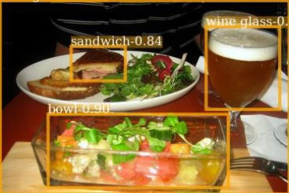
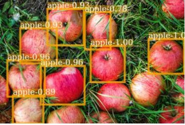
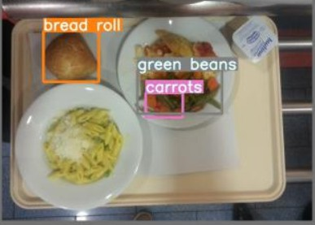
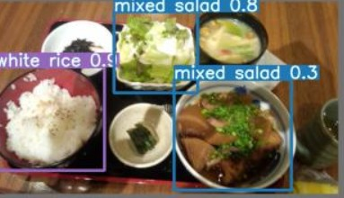

In food waste analysis, accurate detection of what remains on a plate is critical for quantifying waste trends within studies. However, building a fully supervised object detection AI model for food faces a unique barrier: data annotation cost. Unlike generic objects (cars, pedestrians), food items vary wildly in shape, texture, and occlusion. Creating a dataset with precise bounding boxes for thousands of food instances requires thousands of hours of manual labor, creating a bottleneck that limits the amount of high-quality data available for deep learning.

The core engineering question of this project was if we could achieve viable object detection using only image-level labels (e.g., "this image contains pizza") instead of expensive bounding boxes?

  

  
  
  
  

I led the technical feasibility study for a lab grant aimed at automating food waste tracking. My objective was to evaluate Weakly Supervised Object Detection (WSOD) algorithms to determine if they could replace fully supervised models without sacrificing the accuracy needed for policy-level insights in long-term foodwaste studies.

The system evaluates food presence and quantity by analyzing meal tray images. By shifting from bounding-box supervision to image-level supervision, the potential data collection workflow shifts from "draw a box around every apple" to simply "tag this tray as containing apples," reducing annotation time by an estimated 10x based on industry benchmarks.

## Architecture & Engineering Decisions
### The Supervision Spectrum
To contextualize the tradeoff, I mapped the problem against the standard computer vision supervision spectrum. While fully supervised learning requires pixel-perfect or bounding-box annotations (high cost, high precision), weakly supervised learning attempts to infer object locations using only image-level tags (low cost, lower precision).

The challenge lies in the "inference gap": the model must learn where an object is located solely from the knowledge that it exists in the image.

### Algorithm Selection & Implementation
I evaluated three leading WSOD architectures:

1. **TS-CAM (Token Semantic Coupled Attention Map)**: Uses attention mechanisms to localize objects.
2. **CASD (Comprehensive Attention Self-Distillation)**: Aggregates attention maps across feature layers.
3. **PCL (Proposal Cluster Learning)**: Iteratively generates and refines proposal clusters to classify instances.

While TS-CAM and CASD offered effective theoretical approaches, PCL was selected for the final implementation.

- **Why PCL?** It demonstrated superior robustness in early benchmark tests against the Pascal VOC dataset. More importantly, its iterative refinement process was better suited to the noisy, cluttered nature of food imagery where multiple items overlap.
- **Implementation Challenge**: A significant hurdle was the fragmentation of the open-source ecosystem. Existing implementations of these algorithms were scattered across PyTorch, Caffe, and custom C++ codebases, while the lab’s infrastructure relied on TensorFlow. I had to port and adapt the PCL algorithm from scratch, rewriting core data pipelines and loss functions to ensure compatibility without altering the algorithmic logic.

### Data Quality Sensitivity
The most critical technical insight was that WSOD is exponentially more sensitive to data noise than supervised learning. In a fully supervised model, a slightly misaligned bounding box is a minor error. In a weakly supervised model, a single mislabeled image or an image missing additional labels can corrupt the attention maps, causing the model to hallucinate object locations. I spent significant effort normalizing the input data and validating the image-level labels to ensure the signal-to-noise ratio remained high enough for the model to converge.

### Validation & Results
To isolate the performance drop caused purely by the lack of bounding boxes, I conducted a controlled experiment on the Pascal VOC 2007 benchmark (a standard dataset for object detection).

- **Baseline (Fully Supervised)**: Using Faster R-CNN with full bounding box annotations achieved 69.90% mAP@0.5.
- **Target (Weakly Supervised)**: The PCL implementation with only image-level labels achieved 51.86% mAP@0.5.

While there is a ~18-percent drop in mean Average Precision (mAP), the result proves viability. The model successfully localized food items without ever seeing a bounding box during training. For the lab's use case, where the goal is trend analysis rather than pixel-perfect inventory counting, this tradeoff is acceptable. The 10x reduction in annotation time outweighs the moderate loss in precision, enabling the creation of datasets that would otherwise be impossible to build.

### Reflection & Future Work
This project attempted to address the fundamental tension in applied machine learning that high-quality, labeled data is difficult to find and create, especially in niche applications.

- **Conscious Design Choice**: I avoided data augmentation or complex preprocessing. The goal was a straight comparison to measure the pure cost of weak supervision, rather than achieving maximum performance.
- **Domain Transfer**: The evaluation was performed on Pascal VOC (generic objects) as a proxy. The next critical step would be validating this on actual food imagery, where occlusion and lighting variability are higher.
- **Scalability**: The success of this approach suggests that for domains with high annotation costs (medical imaging, agricultural monitoring), WSOD is a viable approach to train models when there are significantly more labeled images at a higher level-of-detail than the ML application desires to produce.

This project demonstrates an ability to navigate the gap between theoretical research and practical deployment, making informed tradeoff decisions between model accuracy and data acquisition feasibility.