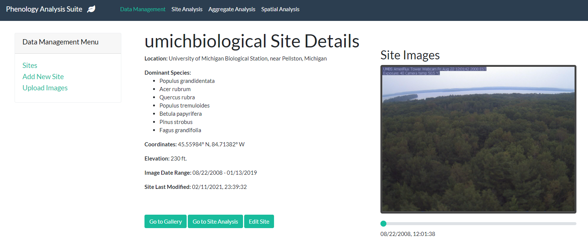
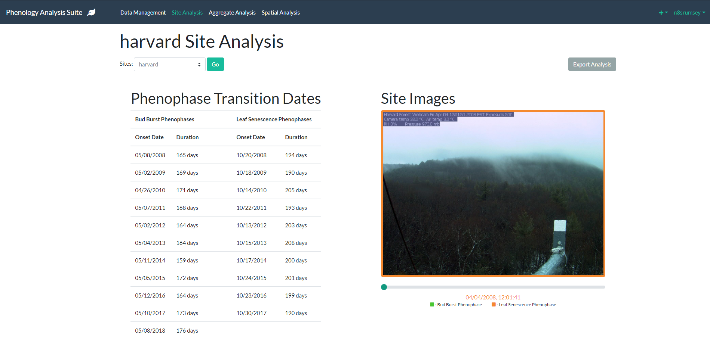
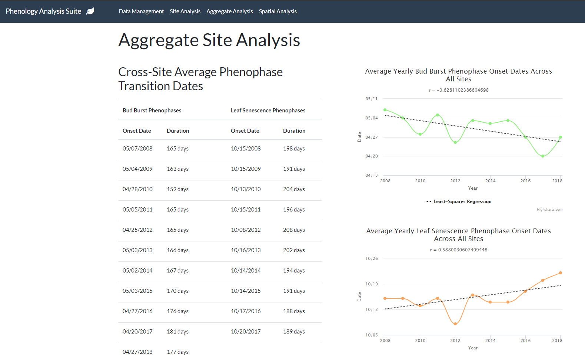
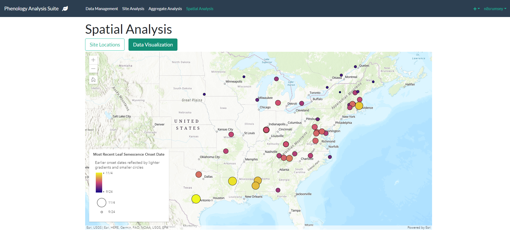

 

  

  <h3 align="center"><b>Machine-Learning Powered Spatiotemporal Analytics System for Deciduous Forest Phenology</b></h3>

  

    <i>A suite of analysis tools using machine learning to study the trends and pattern in phenology of deciduous forests.</i>
  

 

  
 <b> Table of Contents </b> 

  <ol>
    <li> 
      <a href="#abstract">Abstract</a>
    </li>
    <li><a href="#features">Features</a></li>
        <ul>
            <li><a href="#data-management">Data Management</a></li>
            <li><a href="#site-analysis">Site Analysis</a></li>
            <li><a href="#aggregate-analysis">Aggregate Analysis</a></li>
            <li><a href="#spatial-analysis">Spatial Analysis</a></li>
        </ul>
    <li><a href="#built-with">System Architecture</a></li>
  </ol>

## Overview
Shifts in plant phenology provide compelling evidence that ecosystems and species are influenced by climate change. In this project I present a system using machine learning to assist in the study and observation of deciduous forest phenology.

I employed a deep Convolutional Neural Network (CNN) to classify the current phenophase of deciduous forests from a single image, trained using early stopping and k-fold cross validation. The CNN achieved a best accuracy of 60.67%, precision of 60.66%, recall of 60.65%, and F1 Score of 60.66% on the validation dataset. These results exhibited considerably lower performance than published literature. This can be primarily attributed to a faulty dataset, containing frequently mislabeled samples and unrelated images. To address this issue best in the future, the dataset should be curated manually to remove any problematic samples. Additionally, in future work transfer learning should be employed to reduce the overhead of training, so that features do not need to be trained from scratch, decreasing the sensitivity of the CNN to issues in the dataset.

I then developed a website containing an analytics suite which provides analyses based on a timeseries of images of a deciduous forest. The website includes local site, aggregate, and spatial analyses to provide unique insight into the spatiotemporal trends of deciduous forest phenology, using the timeseries of images classified according to phenophase of the deciduous forest. My analyses elucidated spatiotemporal patterns in an earlier bud-burst phenophase consistent with climate-change predictions, demonstrating the potential utility of this analytical suite in assisting researchers.  

## Features

### Data Management

- Manage your phenology data across multiple locations.
- Upload images from the site to take advantage of machine learning algorithms to classify and determine phenophases and transition dates.

### Site Analysis

- Analyze site phenophase onset and duration trends.
- Select a site to view tables and graphs of bud burst and leaf senescence onset dates and durations, as well as view images of the site at said phenophase transition dates.

### Aggregate Analysis

- Analyze aggregate phenophase onset and duration trends.
- View tables and graphs of the average bud burst and leaf senescence onset dates and durations, across all sites as well as view images of the site at said phenophase transition dates.

### Spatial Analysis

- Analyze spatial trends of bud burst and leaf senescence phenophases across multiple sites.
- Using an interactive GIS map, view the spatial patterns between sites' locations of onset dates and durations of bud burst and leaf senescence phenophases.

## System Architecture

* [TensorFlow](https://www.tensorflow.org/)
* [Django](https://www.djangoproject.com/)
* [Bootstrap](https://getbootstrap.com/)
* [ArcGIS](https://developers.arcgis.com/javascript/latest/)
